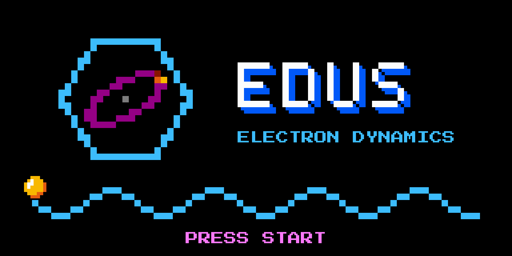

<p align="center">
  
</p>

[](https://doi.org/10.1021/acs.jctc.2c00674)
[](https://arxiv.org/abs/2608.16226)
[](https://github.com/gcistaro/EDUS/releases)
[](https://github.com/gcistaro/EDUS/actions/workflows/ci.yml)

# EDUS — Electron Dynamics and Ultrafast Spectroscopy

EDUS propagates in time the electronic density matrix of an extended system interacting with a classical electric field, at the independent-particle (IPA), RPA or HSEX level. It starts from a Wannier90 tight-binding model and can take the screened Coulomb interaction directly from first principles.

The equations of motion solved in the Wannier gauge are

$$
i \frac{\partial \rho(\mathbf k)}{\partial t} = \Big[ H_0(\mathbf k) + \mathbf E(t)\cdot \boldsymbol\xi(\mathbf k) + \Sigma[\Delta\rho](\mathbf k), \rho(\mathbf k)\Big] + i \mathbf E(t)\cdot \nabla_{\mathbf k} \rho(\mathbf k)
$$

where $H_0$ is the tight-binding Hamiltonian, $\boldsymbol\xi$ the position operator and $\Sigma$ the mean-field self energy (Hartree and/or screened exchange), which depends on the variation of the density matrix with respect to the ground state, $\Delta\rho = \rho - \rho_0$.

## Features

- **Ab-initio input**: tight-binding Hamiltonian and position operator from a Wannier90 `seedname_tb.dat` file.
- **Levels of theory**: IPA, RPA (Hartree) and HSEX (Hartree + screened exchange).
- **Electron–electron interaction**:
  - *ab initio*: bare and screened Coulomb interactions computed with the KCW code of Quantum ESPRESSO;
  - *model*: Rytova–Keldysh (2D) or 3D Coulomb potential with a dielectric constant.
- **Lasers**: any number of sin² pulses, with intensity, frequency (or wavelength), polarization, delay and phase.
- **Observables**: velocity (current), absorption spectra, band and Wannier populations, energy balance and work of the field, projected DOS, band structure.
- **Performance**: MPI parallelization over k points, optional OpenMP threads and GPU (CUDA) support.

## Citing EDUS

If you use EDUS in your work, please cite:

- G. Cistaro *et al.*, *Theoretical Approach for Electron Dynamics and Ultrafast Spectroscopy (EDUS)*, J. Chem. Theory Comput., [doi:10.1021/acs.jctc.2c00674](https://doi.org/10.1021/acs.jctc.2c00674)
- [arXiv:2608.16226](https://arxiv.org/abs/2608.16226), for the ab-initio screening and the version 1.x of the code

and the version of the code you used (see [Releases](https://github.com/gcistaro/EDUS/releases)).

---

## Installation

### Requirements

- C++17 compiler (e.g. GCC ≥ 12) and CMake
- MPI (OpenMPI or MPICH)
- FFTW3 (with its MPI version when compiling with MPI)
- BLAS/LAPACK/LAPACKE (e.g. OpenBLAS), or Intel MKL
- *optional*: HDF5 (to write large matrices in `output.h5`), CUDA (GPU support)
- Python 3 with `numpy` and `scipy` (model potentials and post-processing); `matplotlib`, `h5py` for some post-processing scripts

When using modules on a cluster, MPI, FFTW and HDF5 must be built with the same compiler and MPI, for example:

```bash
module purge
module load gcc/13.2.0 openmpi_gcc/5.0.2_gcc13.2.0 fftw/3.3.10_mpi5_gcc13 hdf5/1.14.3_gcc13_mpi5 python/3.11.4
```

### Building with CMake

The ab-initio models used by the tests are in a git submodule ([EDUS-models](https://github.com/gcistaro/EDUS-models)), so clone with `--recurse-submodules`:

```bash
git clone --recurse-submodules https://github.com/gcistaro/EDUS.git
cd EDUS
mkdir build && cd build
cmake ..
make -j
ctest
```

The main CMake options (`cmake -D<OPTION>=ON ..`):

| Option | Default | Description |
|---|---|---|
| `EDUS_MPI` | `ON` | MPI parallelization |
| `EDUS_MKL` | `OFF` | Use Intel MKL for BLAS/LAPACK |
| `EDUS_GPU` | `OFF` | GPU support (CUDA) |
| `EDUS_HDF5` | `OFF` | Link HDF5 to write large matrices in `output.h5` |
| `EDUS_FFTWTHREADS` | `OFF` | Threads in FFTW |
| `EDUS_MKL_THREAD` | `OFF` | Threads in MKL |
| `EDUS_BATCHGEMM` | `OFF` | Batched GEMM for the k-point matrix multiplications |
| `EDUS_PROFILE` | `ON` | Timings of the functions |

### Building with Spack

<details>
<summary>Click to expand</summary>

Get Spack and set it up:

```bash
git clone -c feature.manyFiles=true https://github.com/spack/spack.git ~/spack
cd ~/spack && git checkout v0.23.1
. ~/spack/share/spack/setup-env.sh
spack external find autoconf automake git libtool m4 perl tar
spack compiler add
```

Create a folder for the environment (e.g. `~/envs/EDUS`) with a `spack.yaml` file inside, replacing `/path/to/EDUS` with the path of your clone:

```yaml
spack:
  specs:
  - edus@1.0 build_type=Release
  view: true
  concretizer:
    unify: true
  develop:
    edus:
      path: /path/to/EDUS
      spec: edus@1.0
  repos:
  - /path/to/EDUS/spack/
```

Then activate the environment, concretize and install:

```bash
spacktivate . -p
spack concretize
spack install -v
```

</details>

---

## Quick start

EDUS reads a single JSON input file:

```bash
mpirun -np 4 ./build/EDUS input.json > output.log 2> output.err
```

A minimal input for an IPA calculation with one laser pulse:

```json
{
    "tb_file": "path/to/seedname",
    "filledbands": 4,
    "grid": [9, 9, 9],
    "dt": 0.01,
    "dt_units": "femtoseconds",
    "finaltime": 20,
    "finaltime_units": "femtoseconds",
    "lasers": [
        {
            "intensity": 1e10,
            "intensity_units": "wcm2",
            "frequency": 3,
            "frequency_units": "electronvolt",
            "polarization": [1, 0, 0],
            "cycles": 5,
            "t0": 0.0,
            "t0_units": "femtoseconds"
        }
    ]
}
```

More examples (Si, GaAs, LiF, hBN, MoS2; IPA and HSEX) are in [`ci-test/inputs`](ci-test/inputs).

---

## Input

All the variables, with their default values and allowed units, are defined in [`src/InputVariables/input_schema.json`](src/InputVariables/input_schema.json). Variables that are not recognized are reported at the beginning of the run, with a suggestion for the closest valid name.

The most important ones:

| Variable | Description |
|---|---|
| `tb_file` | Wannier90 tight-binding file (`seedname_tb.dat`) |
| `filledbands` | Number of filled bands |
| `grid` | k-point grid (the same grid is used in R space) |
| `dt`, `initialtime`, `finaltime` | Time step, initial and final time (each with its `_units`) |
| `solver`, `order` | Time-propagation scheme (default: Runge–Kutta, order 4) |
| `lasers` | List of laser pulses |
| `coulomb`, `method` | Interactions on/off; `ipa`, `rpa` or `hsex` |
| `decay` | Phenomenological decay rate of the density matrix |
| `printresolution` | Print observables every N time steps |
| `kpath` | Path in k space where the band structure is printed |
| `opengap` | Scissor operator added to the gap |

### Electron–electron interaction

With `"coulomb": true` the interaction enters through the self energy Σ, according to `method` (`rpa` or `hsex`). The Coulomb potential can be:

- **ab initio** (`"read_interaction": true`): the bare and screened interactions are read from `bare_file` and `screen_file`, written by the KCW code of Quantum ESPRESSO as matrix elements in the Wannier basis on a set of R vectors;
- **model** (`"read_interaction": false`): chosen with `coulomb_model`:
  - `rytova_keldysh`: Rytova–Keldysh potential for 2D materials, with screening length `r0` and dielectric constant `epsilon` of the environment;
  - `vcoul3d`: 3D Coulomb potential screened by `epsilon`.

### Band structure

To print the band structure along a path, add the vertices in crystal coordinates:

```json
"kpath": [ [0.000, 0.000, 0.000],
           [0.500, 0.500, 0.000],
           [0.333, 0.667, 0.000],
           [0.000, 0.000, 0.000] ]
```

This writes `BANDSTRUCTURE.txt` and `plotbands.gnu`; plot it with `gnuplot plotbands.gnu`.

### Scissor operator

`opengap` rigidly shifts the valence bands down by `opengap/2` and the conduction bands up by `opengap/2`, without changing the eigenvectors:

```json
"opengap": 1.0,
"opengap_units": "electronvolt"
```

EDUS then writes a `wannier_tb.dat` file with the corrected Hamiltonian, which can be used to restart the simulation.

---

## Output

The time-dependent observables are written in the `Output/` folder:

| File | Content |
|---|---|
| `Time.txt` | Time steps |
| `Laser.txt`, `Laser_A.txt` | Electric field and vector potential of the lasers |
| `Velocity.txt` | Velocity (current) of the electrons |
| `Energy.txt` | Band and mean-field energy, power and work of the field |
| `Population.txt`, `Population_wannier.txt` | Populations in the band and in the Wannier basis |

Other files: `pdos.txt` (projected DOS), `BANDSTRUCTURE.txt` (if `kpath` is given) and `output.h5` (large matrices, selected with `toprint`, when compiled with HDF5).

### Post-processing

Python scripts in [`Postproces/`](Postproces):

| Script | Description |
|---|---|
| `Absorbance.py` | Absorption spectrum from the velocity |
| `HHG.py` | High-harmonic generation spectrum |
| `Velocity_fft.py` | Fourier transform of the velocity |
| `Recap.py` | Plots of the main observables |
| `RytovaKeldysh.py` | Rytova–Keldysh potential for a Wannier90 model |
| `hermitize_tb.py` | Makes a `seedname_tb.dat` file exactly Hermitian |

---

## Versions

EDUS follows [semantic versioning](https://semver.org). The list of changes of each version is in [`docs/releases`](docs/releases) and on the [Releases](https://github.com/gcistaro/EDUS/releases) page.

## Contributing

Contributions are welcome: see [CONTRIBUTING.md](CONTRIBUTING.md) for the workflow and the code structure.
